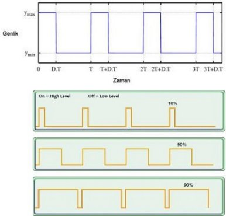

**PWM (Pulse Width Modulation)** 

Sinyal genişlik modülasyonudur. Sinyal bilgilerinin genişliklerini kontrol ederek, çıkışta üretilmek istenen analog elektriksel değerin veya sinyalin elde edilmesi tekniğidir.

Genellikle uygulamalarda, 1kHz – 200kHz arasındaki frekanslarda çalışılır.

PWM tekniğinin temeli kare dalga üretmekte yatıyor. Bu kare dalga da genellikle referans olarak aldığı dalganın ortalaması kadar büyüklüğe sahip oluyor. Bunun yanı sıra sistemdeki dalganın büyüklüğü ise görev döngüsünün büyüklüğü ile doğru orantılıdır.

PWM dalgasını elde etmede bazı yöntemler vardır.Bunlar Delta, Sigma-Delta, Boşluk-vektör, Direkt-tork kontrol, Zaman bölücü

DELTA YÖNTEMİ:

İntegral alıcı ve limitleyici devre yapıları kullanılır. İntegral sonucunun limitlere değmesi “off”, diğer durumlarda “on” durumu oluştuğu için kare dalga oluşur.

SİGMA-DELTA YÖNTEMİ:

Çıkış sinyalini referans alınan sinyalden çıkartıp hata sinyalini elde ederiz. Hata sinyalinin integralinin sonucuna göre eğer limite değiyorsa “off”, değmiyorsa “on” durumu oluşturularak kare dalga elde edilir.

BOŞLUK-VEKTÖR YÖNTEMİ:

3 fazlı AC uygulamalar için algoritma kullanarak elde ederiz.

DİREK TORK KONTROL YÖNTEMİ:

Alternatif akım motorlarında kullanılmak üzere geliştirilmiş bir tekniktir. Delta modülasyon tekniğinden üretilmiştir. Motora gönderilen sinyal belirli bir filtreden geçirilir ve motorun torku ile manyetik akı kontrol altında tutulur.

ZAMAN BÖLÜCÜ:

Genellikle mikroişlemcilerin PWM çıkışları tarafından kullanılır. Değişken görev döngüsüne sahip devrelerde de kullanılır.

PWM geniş uygulama alanlarına sahiptir. 

Haberleşme Sistemleri: 0” ve “1”lerden oluşan lojik haberleşme devrelerinde kare dalga ve **PWM** çok sık kullanılır.

Güç Aktarımı ve Elektrik Makineleri: Bazı devrelerde anahtarlamada MOSFET ya da IGBT kullanılırken giriş gücünü ayarlamak için VARYAK kullanılır. Fakat bunlar istenilen fonksiyonu yerine getiremediğinde PWM kontrolü kullanılır. Özellikle motor devir kontrolü.

Voltaj Regülatör Devreleri: Voltajı kesme ve düzenleme işlemleri ile regüle edebilen **PWM** tekniği sonucunda bir takım elektronik gürültü oluşur. Ancak LC filtre kullanarak bu gürültüyü kesebiliriz.

Ses Efektleri ve Yükselticiler: Osilatörler ile birlikte bazı ses efektlerini elde etmek için **PWM** tekniği kullanılabiliyor. Aynı zamanda yükseltici devrelerinde ve amfilerde kontrol amacıyla da PWM tekniğine başvuru yapılabiliyor.

PWM hakkında izlediğim 2 videonun linki:

1-https://www.google.com/search?q=pwm+nedir&oq=pwm+&gs\_lcrp=EgZjaHJvbWUqBwgBEAAYgAQyBggAEEUYOTIHCAEQABiABDIHCAIQABiABDIHCAMQABiABDIHCAQQABiABDIHCAUQABiABDIHCAYQABiABDIHCAcQABiABDIHCAgQABiABDIHCAkQABiABNIBCTU0ODFqMGoxNagCALACAA&sourceid=chrome&ie=UTF-8#fpstate=ive&vld=cid:beee1d49,vid:B8TWy575Yig,st:0

2-

https://www.google.com/search?q=pwm+nedir&oq=pwm+&gs\_lcrp=EgZjaHJvbWUqBwgBEAAYgAQyBggAEEUYOTIHCAEQABiABDIHCAIQABiABDIHCAMQABiABDIHCAQQABiABDIHCAUQABiABDIHCAYQABiABDIHCAcQABiABDIHCAgQABiABDIHCAkQABiABNIBCTU0ODFqMGoxNagCALACAA&sourceid=chrome&ie=UTF-8#fpstate=ive&vld=cid:beee1d49,vid:B8TWy575Yig,st:0

