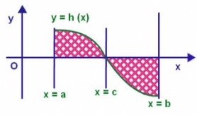

# PID (Proportional, Integral, Derivative) Control
PID kontrolörler bir çıkıştan geri gelen feedback (geribesleme)     sinyali ile giriş (input veya reference) sinyalini karşılaştırarak hata oranını bulur. Daha sonra, bu hatayı belirli bir katsayı ile çarpıp, türevini ve integralini alır. Oluşan sonuç çıkışa (output) gönderilir ve oluşan hata bu döngü ile minimuma indirilmeye çalışılır

Ref = İstenilen değer

Gelen = Şu an ki konum

Hata = Ref - Gelen

Oransal (Proportional) Terim

Oransal terimin amacı sistemden gelen hatayı bir kat sayı ile çarparak küçültmektir. Yüksek seçmememiz gerekiyor çünkü hata istenilen değerlere yaklaştığında çıkışta oslilosyon görülme ihtimali yüksektir.

P = Kp \* Hata

İntegral (Integral) Terimi

Hatanın alanını buluruz. Her bir dt çevriminde hata ki katsayısıyla çarpılarak toplanır. Sürekli toplandığı için integral çok artarsa tekrar azalmasını beklemek zaman alır. Bu yüzden integrali sınırlamak sistemin çabuk toparlamasını sağlayacaktır.

dt = pid fonksiyonuna her girdiğindeki geçen zaman.

I = I + (**Ki** \* Hata \* dt)

Türev (Derivative) Terimi

Sistemdeki 2 örnek arasındaki zamanı hesaplar. Hatada bir değişim yoksa türev sıfırdır.

EHata = Bir önceki hatanın değeri (eski hata)

HD = Hata – EHata

D = (Kd \* HD)/dt

PID Algoritması

Deneme-yanılma yöntemiyle bulduğumuz katsayılar; Kp, Ki, Kd. Optimum katsayıları bulmak için değerde değişiklik yapıp sistemi gözlemek gerekir. Genelde potansiyometre kullanarak bulunur.

Hata = Ref - Gelen

HD = Hata - EHata

P = Kp \* Hata

I = I + (Ki \* Hata \* dt)

D = (Kd \* HD)/dt

PID = P + I + D

EHata = Hata

PID Kontrolün transfer fonksiyonu:

Örnek PID STM Kodu

#include "stm32f4xx\_hal.h" // Include header for your specific STM32 model

// Function prototypes (replace with your actual implementation)

float read\_sensor\_value(void);

void set\_actuator\_output(float output);

float setpoint = 50.0f; // Desired output value (e.g., temperature)

float kp = 1.0f;       // Proportional gain

float ki = 0.1f;       // Integral gain

float kd = 0.0f;       // Derivative gain (initially set to 0)

float error = 0.0f;

float integral\_term = 0.0f;

float derivative\_term = 0.0f;

void HAL\_SysTick\_Callback(void) {

`  `// Read sensor value

`  `float sensor\_value = read\_sensor\_value();

`  `// Calculate error

`  `error = setpoint - sensor\_value;

`  `// Update integral term (prevent windup)

`  `if (fabs(error) < 1.0f) { // Adjust threshold as needed

`    `integral\_term += error;

`  `} else {

`    `integral\_term = 0.0f;

`  `}

`  `// Calculate derivative term (low-pass filtering can be added)

`  `derivative\_term = (error - previous\_error) \* HAL\_GetTickFrequency(); // Adjust for your timer frequency

`  `// Calculate PID output (adjust based on your actuator's control range)

`  `float output = kp \* error + ki \* integral\_term + kd \* derivative\_term;

`  `if (output > 100.0f) { // Adjust limits as needed

`    `output = 100.0f;

`  `} else if (output < 0.0f) {

`    `output = 0.0f;

`  `}

`  `// Set actuator output

`  `set\_actuator\_output(output);

`  `// Update previous error for derivative term

`  `previous\_error = error;

}

Bu kod bir sensörden veri okuyarak ve bir aktüatörü kontrol ederek bir sistemi istenen davranışa ulaştırmak için PID kontrolü kullanır.

Örnek PID ARDUINO Kodu

#**include** <PID\_v1.h>

#**define** input\_pin 0               // Kullanacağımız pinleri belirliyoruz.

#**define** role\_pin 6

**int** Setpoint, Input, Output;      // Değişkenleri tanımlıyoruz.

**double** Kp=1, Ki=5, Kd=1;          // Ayar parametrelerimizi tanımlayıp belirliyoruz.

PID myPID(&Input, &Output, &Setpoint, Kp, Ki, Kd, DIRECT);

**int** WindowSize = 1000;           // Pulse için belirlediğimiz maksimum süre.

**unsigned** **long** windowStartTime;

**void** setup()

{

`  `Serial.begin(9600);

`  `windowStartTime = millis();               // Değişkenlerimizi atıyoruz, analog iletişimi başlatıyoruz.

`  `Setpoint = 90;                            // Suyun gelmesini istediğimiz sıcaklık değeri.

`  `myPID.SetOutputLimits(0, WindowSize);     // PWM işleminin gerçekleşme süre aralığını belirliyoruz.

`  `myPID.SetMode(AUTOMATIC);                 // PID kontrolörümüzü açıyoruz.

}

**void** loop()

{

`  `Input = analogRead(input\_pin);            // PID kontrolörümüze göre rölenin açık duruma geçmesi

`  `myPID.Compute();                          // veya kapalı duruma geçmesini sağlayan kod.

`  `if (millis() - windowStartTime > WindowSize)

`  `{ 

`    `windowStartTime += WindowSize;

`  `}

`  `if (Output < millis() - windowStartTime) digitalWrite(role\_pin, HIGH);

`  `else digitalWrite(role\_pin, LOW);

}

Bu kod, bir PID kontrolörü kullanarak sensör geri bildirimine göre su sıcaklığını düzenleyen röle kontrollü bir sistemi uygulamaktadır. PID kontrolörü, röle durumunu sürekli olarak ayarlayarak istenen sıcaklığı belirli bir atım penceresi içinde tutar.

KAYNAKÇA

<https://www.projehocam.com/pid-kontrol-algoritmasi-nedir/#:~:text=PID%20asl%C4%B1nda%20bir%20kontrol%20geri,Integral%2CDerivative)%20diye%20tan%C4%B1m>

<https://steemit.com/utopian-io/@drencolha/arduino-pid-library-kurulumu-ve-kullanimi-turkish-tutorial>

